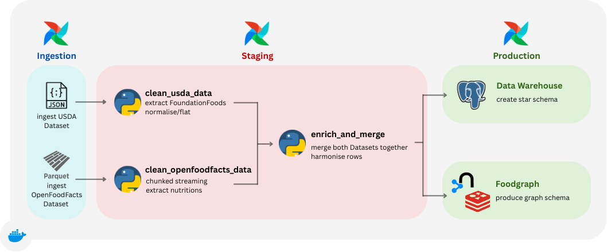
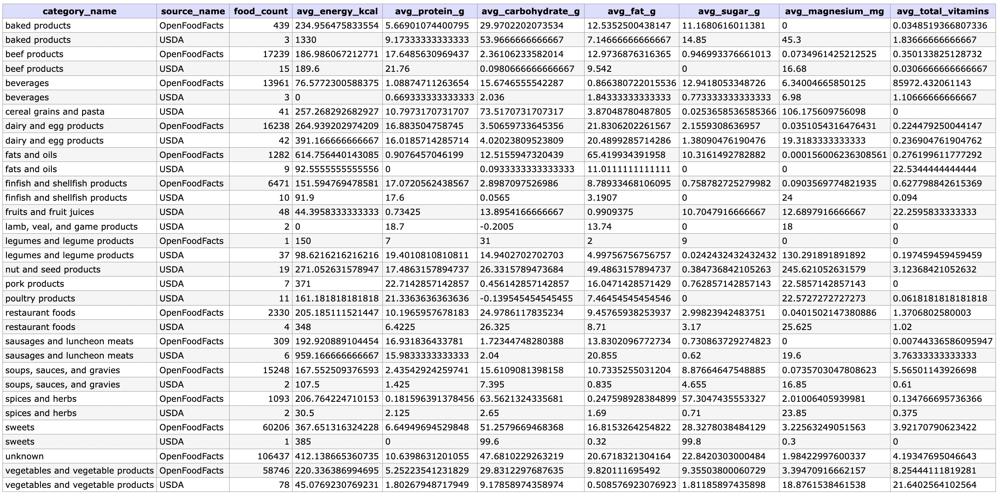
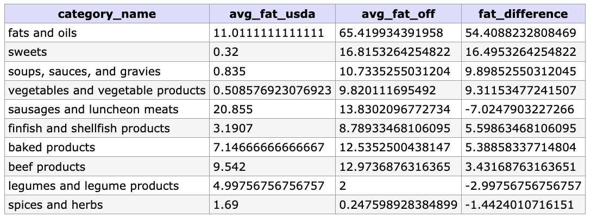
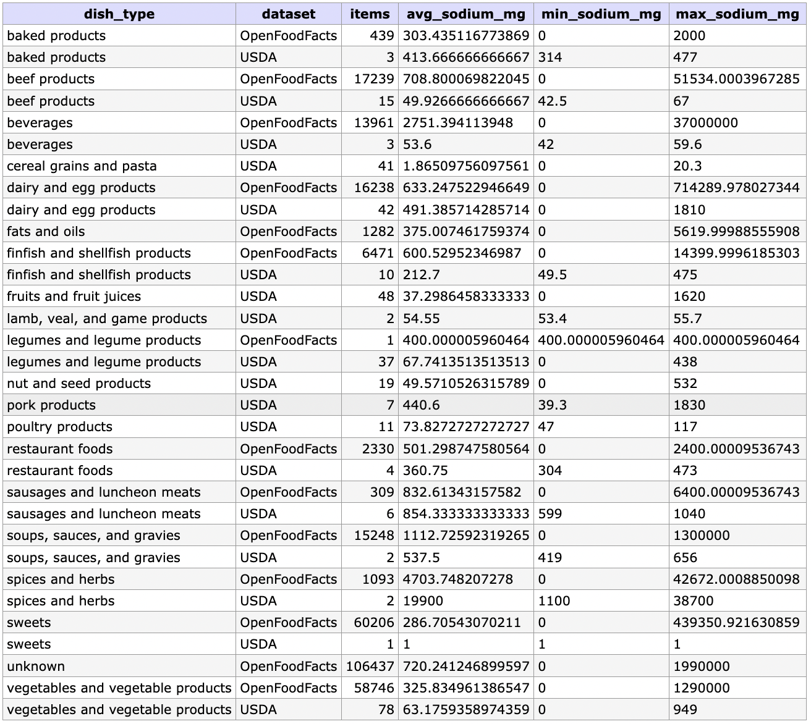
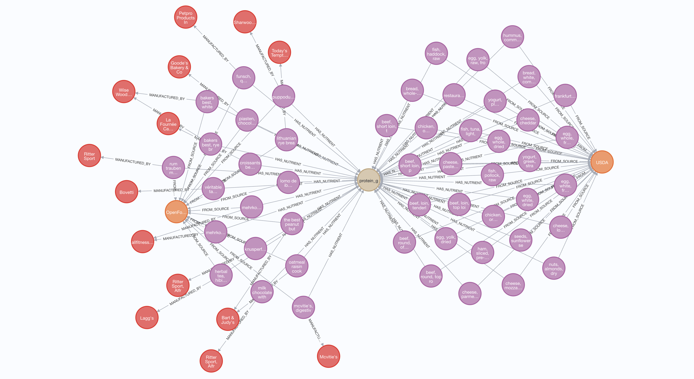
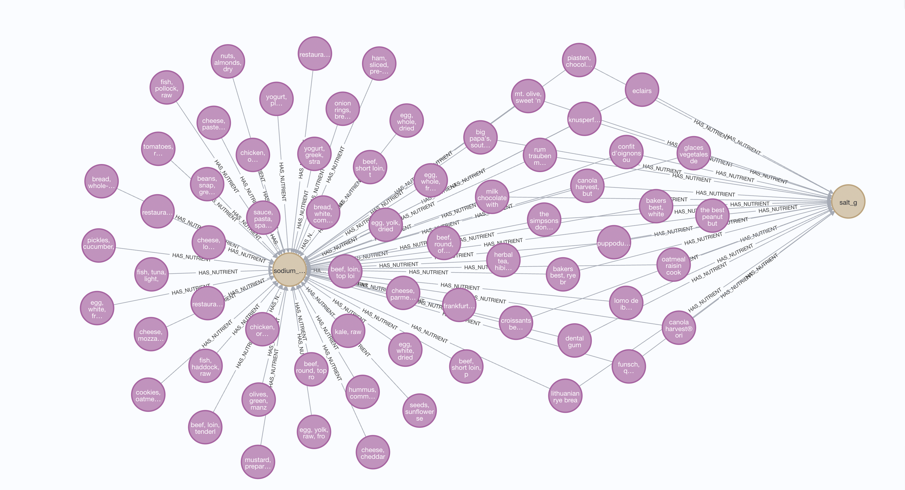
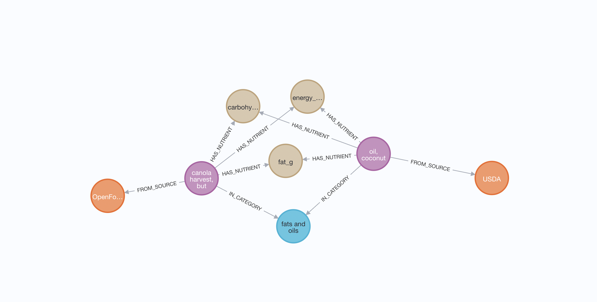

# OT7 - Foundation of Data Engineering - 2025/2026


Project [DATA Engineering](https://www.riccardotommasini.com/courses/dataeng-insa-ot/) is provided by [INSA Lyon](https://www.insa-lyon.fr/).

Students: **Ahmed MANSOUR, Robert MICHEL, Stefan SEVERIN**


## Abstract

This README describes the ETL pipeline we implemented as part of the OT7 Data Engineering project (2025/2026). The pipeline ingests two main sources (OpenFoodFacts and USDA Foundation Foods), performs deterministic cleaning and unit normalization, produces a merged and enriched dataset, and exposes analytics-ready artifacts in a Postgres warehouse. We also provide an optional Neo4j-based graph for relationship exploration. The text below explains what we actually did, which functions implement each step, and why we made the choices we did.

## Introduction

This project was built during the course to practise end-to-end data engineering: collecting heterogeneous public datasets, making them analysis-ready, and designing small analytical artifacts to answer domain-specific questions. We intentionally kept the stack simple—Airflow for orchestration, Pandas/pyarrow for transformation, Postgres for warehousing and Neo4j for graph exploration—so the code is readable and reproducible on a laptop with Docker.

The implementation is pragmatic: each core operation is written as a small Python function inside the Airflow DAGs so reviewers can run and inspect the steps easily. Where possible we document the exact function names used in the DAGs to make it simple to find the code that performs a transformation.

## Pipeline


## Datasets Description 

For this projects we utilize 2 datasources:
- OpenFoodFacs Dataset
- U.S. Department of Agriculture [(USDA) Dataset](https://fdc.nal.usda.gov/fdc-datasets/FoodData_Central_foundation_food_json_2025-04-24.zip)

Since the OpenFoodfacts dataset was a huge .parquet file (> 4 GB) it's not directly included in the repository.</br>
Please download the file 'food.parquet' from the the following website: [OpenFoodFacts](https://huggingface.co/datasets/openfoodfacts/product-database/viewer/default/food) </br> 

Storage and conventions used in the repo:

- Raw/unprocessed files (add the food.parquet here): `airflow/data/dataunclean/`
- Landing (ingested, immutable copies used by DAGs): `airflow/data/landing/`
- Staging (cleansed, typed snapshots): `airflow/data/staging/`


## Ingestion

We implemented a minimal, transparent ingestion layer whose main job is to place immutable copies of raw files into the pipeline's landing area and record their origin. 
The ingestion DAG is defined in `airflow/dags/ingestion_dag.py`; the two most important functions / tasks are:

- `_ensure_directories(...)` — a small helper that creates required folders inside the container (called at DAG import time).
- Two BashOperator tasks: `ingest_json` and `ingest_parquet` which run a `cp` command to copy the source files from the host-mounted `data` folder into the container landing zone. The source and destination paths are defined at the top of `ingestion_dag.py` as `SRC_JSON`, `SRC_PARQUET`, and `DST_JSON`, `DST_PARQUET`.

What we did and why

We chose the simplest robust approach for ingestion for two reasons: (1) the raw files are large and often manually downloaded (especially OpenFoodFacts), and (2) keeping ingestion simple makes the pipeline easy to reproduce and debug. The ingestion tasks intentionally avoid heavy parsing: they only copy files and leave cleaning and heavy work to the staging DAG.

Where to put data

- Place USDA JSON at `airflow/data/dataunclean/FoodData_Central_foundation_food_json_2025-04-24.json` (or update `SRC_JSON` in `ingestion_dag.py`).
- Place the OpenFoodFacts Parquet (commonly named `food.parquet`) in `airflow/data/dataunclean/`. 
The ingestion DAG copies it to `airflow/data/landing/`.

Notes on idempotence and ops

The ingestion tasks are written as simple file-copy operations. They are idempotent in the sense that re-running them replaces the landing files with identical content if the source has not changed. We log and track files via the landing folder structure; a future improvement would be a small ingestion metadata table (filename + checksum) recorded in Postgres; this is left as a low-risk follow-up.

## Staging 

Purpose

The staging layer is where raw heterogenous inputs are converted to a consistent, typed schema suitable for transformation and loading into the warehouse. Staging is focused on deterministic cleaning, basic validation and unit harmonization.

Key operations

- Column normalization: standardize column names and data types across sources.
- Unit conversion: convert all nutrient measurements to a canonical per-100g basis and consistent units (grams, milligrams, micrograms as appropriate).
- Deduplication: identify duplicate products using product identifiers when available.
- Outlier detection: flag or drop rows with impossible values (negative nutrients, extreme densities).
- Category vocabularies between sources will differ: manual mappings are maintained in the staging file 

Implementation notes

- For moderate-sized inputs we use Pandas vectorized transformations. For working with the full OpenFoodFacts Parquet, run chunked reads (`chunk_size = 10000`) to avoid excessive memory usage.
- Staging outputs are written to `airflow/data/staging/` (Parquet) and loaded into Postgres staging tables under the `warehouse` schema for SQL-based transformations.


## Production

Produce analytics-ready datasets: dimensional tables and a fact table (star schema) optimized for SQL analysis and dashboarding. In addition, materialize a small Neo4j graph for relationship queries where graphs provide value.

Design choices

- Use a star schema: a central `fact_food_nutrition` containing product_id, nutrient_id and value_per_100g, linked to `dim_product`, `dim_category`, `dim_nutrient` and `dim_source`.
- Store the analytical tables in Postgres (`warehouse` database) to leverage SQL for aggregation and joins.
- Use Neo4j for product-ingredient relationships and category co-occurrence graphs. Neo4j is optional and intended for exploratory analysis.

Data versioning and backup

The `backup_to_production()` function ensures data persistence and versioning by creating timestamped copies of the enriched dataset in the production zone. Each pipeline run generates a uniquely named backup file (e.g., `enriched_food_data_20260105_143022.parquet`) while maintaining a "latest" version for immediate access by downstream processes. This approach provides both historical data recovery capabilities and ensures the most recent processed data is always readily available.


### Queries 
1. How does the total nutrient content (protein, magnesium, vitamins) of a homemade dish compare to that of a premade product?
```
SELECT
    c.category_name,
    s.source_name,
    COUNT(*)                           AS food_count,
    AVG(f.energy_kcal)                 AS avg_energy_kcal,
    AVG(f.protein_g)                   AS avg_protein_g,
    AVG(f.carbohydrate_g)              AS avg_carbohydrate_g,
    AVG(f.fat_g)                       AS avg_fat_g,
    AVG(f.sugar_g)                     AS avg_sugar_g,
    AVG(f.magnesium_mg)                AS avg_magnesium_mg,
    AVG(f.vitamin_a_mcg + f.vitamin_c_mg + f.vitamin_d_mcg + f.vitamin_e_mg)
                                       AS avg_total_vitamins
FROM fact_food_nutrition f
JOIN dim_category c ON f.category_key = c.category_key
JOIN dim_source   s ON f.source_key   = s.source_key
WHERE s.source_name IN ('USDA','OpenFoodFacts')
GROUP BY c.category_name, s.source_name
ORDER BY c.category_name, s.source_name;
```
<details>

<summary>Query solution</summary>



</details> 

2. Which food categories show the largest fat content differences between raw and processed versions?
```
SELECT c.category_name,
       AVG(CASE WHEN s.source_name = 'USDA' THEN f.fat_g END) AS avg_fat_usda,
       AVG(CASE WHEN s.source_name = 'OpenFoodFacts' THEN f.fat_g END) AS avg_fat_off,
       (AVG(CASE WHEN s.source_name = 'OpenFoodFacts' THEN f.fat_g END) - 
        AVG(CASE WHEN s.source_name = 'USDA' THEN f.fat_g END)) AS fat_difference
FROM fact_food_nutrition f
JOIN dim_category c ON f.category_key = c.category_key
JOIN dim_source s ON f.source_key = s.source_key
WHERE f.fat_g IS NOT NULL
GROUP BY c.category_name
HAVING COUNT(CASE WHEN s.source_name = 'USDA' THEN 1 END) > 0 
       AND COUNT(CASE WHEN s.source_name = 'OpenFoodFacts' THEN 1 END) > 0
       AND ABS(AVG(CASE WHEN s.source_name = 'OpenFoodFacts' THEN f.fat_g END) - 
               AVG(CASE WHEN s.source_name = 'USDA' THEN f.fat_g END)) > 0
ORDER BY ABS(AVG(CASE WHEN s.source_name = 'OpenFoodFacts' THEN f.fat_g END) - 
             AVG(CASE WHEN s.source_name = 'USDA' THEN f.fat_g END)) DESC
LIMIT 10;
```

<details>

<summary>Query solution</summary>



</details>

3.How does sodium (salt) content differ between homemade and commercial dishes of the same type?
```
SELECT
    c.category_name AS dish_type,
    s.source_name   AS dataset,
    COUNT(*)        AS items,
    AVG(f.sodium_mg) AS avg_sodium_mg,
    MIN(f.sodium_mg) AS min_sodium_mg,
    MAX(f.sodium_mg) AS max_sodium_mg
FROM fact_food_nutrition f
JOIN dim_category c ON f.category_key = c.category_key
JOIN dim_source   s ON f.source_key   = s.source_key
WHERE s.source_name IN ('USDA','OpenFoodFacts')
GROUP BY c.category_name, s.source_name
HAVING AVG(f.sodium_mg) > 0
ORDER BY c.category_name, s.source_name;
```

<details>

<summary>Query solution</summary>



</details> 


## Foodgraph

Purpose and model

The food graph is a complementary Neo4j model to explore relationships that are cumbersome in relational schema, e.g., ingredient co-occurrence, brand-category-ingredient linkages, or similarity between products via shared ingredients.

Nodes and relationships (example):

- Product (product_id, name, brand)
- Ingredient (ingredient_id, name, normalized_name)
- Category (category_id, name)
- (Product)-[:CONTAINS]->(Ingredient)
- (Product)-[:BELONGS_TO]->(Category)

Notes

- The Neo4j instance is optional for main analytics; it is used for exploration and visualization.

### Queries 
1. All Foods with Categories
```
MATCH (f:Food)-[:IN_CATEGORY]->(c:Category)
RETURN f, c 
```

<details>

<summary>Query solution</summary>



</details>


2. Nutrient Comparison (Homemade vs Premade): </br>
How does nutrient content compare between raw (USDA) and processed (OpenFoodFacts) foods?
```
MATCH (f:Food)-[:FROM_SOURCE]->(s:Source)
                WHERE f.energy_kcal IS NOT NULL
                RETURN 
                    s.name as source,
                    f.food_type as food_type,
                    count(f) as food_count,
                    round(avg(f.protein_g), 2) as avg_protein_g,
                    round(avg(f.fat_g), 2) as avg_fat_g,
                    round(avg(f.carbohydrate_g), 2) as avg_carb_g,
                    round(avg(f.total_vitamins), 2) as avg_total_vitamins,
                    round(avg(f.vitamin_density), 4) as avg_vitamin_density
                ORDER BY source, food_type
```

<details>

<summary>Query solution</summary>



</details>


3. Top Contributors to Calories, Fat, Sugar: </br>
Which categories contribute most to calories, fat, and sugar?
```
MATCH (f:Food)-[:IN_CATEGORY]->(c:Category)
                WHERE f.energy_kcal IS NOT NULL AND f.energy_kcal > 0
                WITH c.name as category,
                     sum(f.energy_kcal) as total_calories,
                     sum(f.fat_g) as total_fat,
                     sum(f.sugar_g) as total_sugar,
                     count(f) as food_count
                RETURN category, food_count,
                       round(total_calories, 0) as total_calories,
                       round(total_fat, 1) as total_fat_g,
                       round(total_sugar, 1) as total_sugar_g,
                       round(total_calories / food_count, 1) as avg_calories_per_food
                ORDER BY avg_calories_per_food DESC
                LIMIT 10
```
<details>

<summary>Query solution</summary>



</details>

## Requirements

- Docker Desktop (Mac/Windows) or Docker Engine (Linux).
- Docker Compose v2+.
- Optional for local scripts: Python 3.10+, Pandas, PyArrow, Dask (for large parquet processing), and psycopg2-binary for Postgres access.

## How to run?

1. Ensure Docker is installed and running on your machine.
2. Clone the repository and change into the `airflow/` directory:

```bash
git clone <repo-url>
cd Wizards-of-Oz/airflow
```

3. Start the services (build images if needed):

```bash
docker compose up --build
```

4. Visit the services in your browser:

  | Service  | URL |
  | ------------- | ------------- |
  | Adminer  |  http://localhost:8081/ |
  | Airflow  | http://localhost:8082/  |
  | Neo4j  | http://localhost:7474/browser/  |

5. Credentials and sensitive configuration are supplied via the `.env` file used by docker compose. If you run into connection issues, verify the `.env` values and the container logs.

Notes and first-time setup

- In Adminer the server name is `postgres` (not `db`).
- If you need to reinitialize databases (first-time run after changes to `airflow/db/init`), run:

```bash
docker compose down -v
docker compose up --build
```

- Place the OpenFoodFacts `food.parquet` into `airflow/data/dataunclean/` before triggering the ingestion DAG if you intend to run the full dataset ingestion.

## Limitations & Challenges
During the development of this data pipeline, we encountered several significant challenges. The OpenFoodFacts food.parquet file was extremely large, requiring us to implement chunked reading to avoid memory issues and ensure processing could complete within reasonable time limits. Additionally, we spent considerable time debugging data quality issues, particularly discovering that the USDA JSON file was being parsed incorrectly, resulting in numerous NaN values appearing throughout the dataset. We also had to account for variations in nutrient naming conventions across different data sources, implementing flexible matching logic to handle these inconsistencies and ensure accurate nutrient extraction.</br>
Another important limitation concerns dataset imbalance. Due to the significantly larger size of OpenFoodFacts compared to the other data sources, some aggregated comparisons may be biased toward this dataset. This imbalance should be taken into account when interpreting the results of comparative analytics.


## Note for Students

* [x] Clone the created repository offline;
* [x] Add your name and surname into the Readme file and your teammates as collaborators
* [x] Complete the field above after project is approved
* [x] Make any changes to your repository according to the specific assignment;
* [x] Ensure code reproducibility and instructions on how to replicate the results;
* [x] Add an open-source license, e.g., Apache 2.0;
* [x] README is automatically converted into pdf
